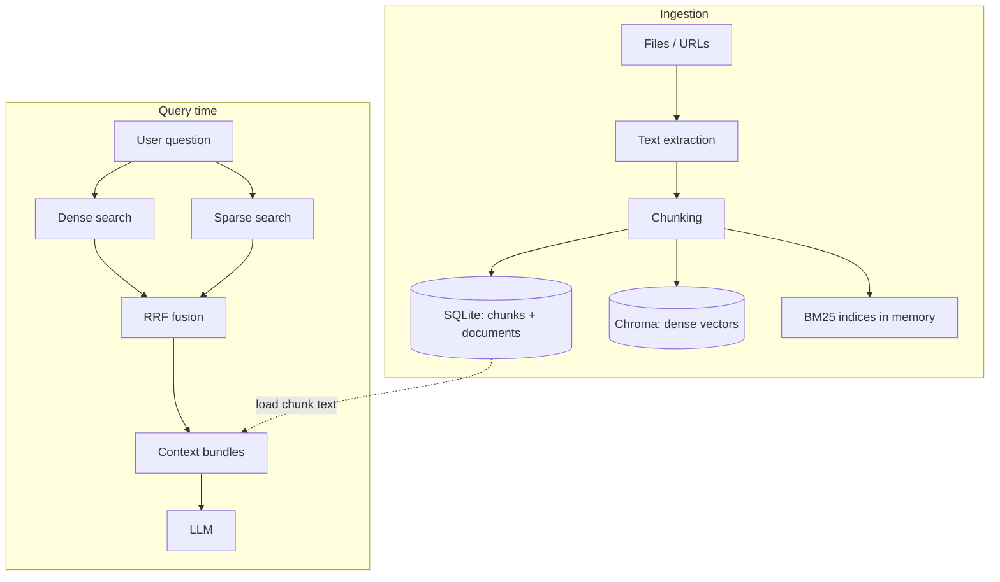

# RAG architecture

This document describes how **Retrieval-Augmented Generation** is implemented in Enterprise AI Copilot: how documents become searchable chunks, how queries retrieve evidence, and how the LLM produces grounded answers.

---

## End-to-end flow

---

## 1. Ingestion

### 1.1 Text extraction

Uploaded files (PDF, Word, Excel, PowerPoint, plain text, CSV, Markdown) or **URL** content are normalized to plain text via `app/services/file_extractors.py`. Non–text-binary types (e.g. images, audio, video) are **not** ingested in the current product.

### 1.2 Chunking

`app/rag/chunking.py` splits text into overlapping segments:

| Setting | Default | Role |
|---------|---------|------|
| `chunk_size` | 800 | Target characters per chunk |
| `chunk_overlap` | 120 | Characters shared between adjacent chunks to preserve context at boundaries |

Whitespace is collapsed before splitting. Empty documents fail ingest with a clear status.

### 1.3 Persistence and indexes

For each document, the pipeline:

1. **Deletes** prior chunks for that document (SQLite + Chroma).
2. **Inserts** new `Chunk` rows in **SQLite** (source of truth for full text, `document_id`, `department_id`, ordering).
3. **Upserts** the same chunks into **Chroma** with:
   - **ID** = `str(chunk.id)` (aligned with SQLite primary key).
   - **Document** = chunk text (embedded by Chroma’s embedding function).
   - **Metadata** = `document_id`, `department_id`, `filename`, `source_type`, etc.
4. **Rebuilds BM25** for the affected department slice and the **global** corpus in `app/rag/sparse_store.py`.

Chroma uses **cosine** space on the HNSW index (`dense_store.py`). Embeddings are produced by **Sentence-Transformers** (`embedding_model`, default `all-MiniLM-L6-v2`) via `SentenceTransformerEmbeddingFunction`.

---

## 2. Retrieval (hybrid)

At question time, `app/rag/hybrid_retriever.py` runs **two** retrievers in parallel, then **fuses** their rankings.

### 2.1 Dense retrieval

- **Store:** Chroma collection `enterprise_chunks`.
- **Mechanism:** The user query is embedded with the same model as ingest; **nearest neighbors** are returned (cosine).
- **Top‑k:** `dense_top_k` (default **12**).
- **Filter:** Optional `department_id` metadata filter. The chat API uses **`None`** so retrieval spans **all** chunks (single global corpus from the product perspective).

### 2.2 Sparse retrieval

- **Store:** In-memory **BM25Okapi** (`rank_bm25`) over tokenized chunk text.
- **Tokenization:** Lowercased, non-word split (`sparse_store.py`).
- **Top‑k:** `sparse_top_k` (default **12**).
- **Indices:** One index per `department_id` plus a **global** index (`department_id=None`). Chat queries use the global path when `department_id` is `None`.

Sparse retrieval favors **lexical** overlap (exact terms, SKUs, names, policy phrases) that dense vectors can miss.

### 2.3 Reciprocal Rank Fusion (RRF)

Ranked lists from dense and sparse are merged with **RRF**:

\[
\text{score}(d) = \sum_{\text{list } L} \frac{1}{k + \text{rank}_L(d)}
\]

- **`rrf_k`** (default **60**) is the RRF constant (same role as “k” in standard RRF writeups).
- Chunks are sorted by fused score; the top **`hybrid_top_k`** (default **8**) unique chunk IDs are kept.

This avoids relying on a single similarity scale and surfaces chunks that rank well in **either** channel.

### 2.4 Hydration from SQLite

Fused IDs are resolved against SQLite (`Chunk` joined with `Document` for **filename**). Final context items include chunk text (preferring Chroma-returned text when present), `document_id`, and metadata for **sources** in the API response.

---

## 3. Generation

`app/rag/llm.py` builds a prompt:

- **System:** Instructs the model to use the **user message** and **retrieved knowledge-base snippets** (`[KB 1]`, `[KB 2]`, …).
- **User payload:** Full user question plus the concatenated snippet block (or a “no matching documents” placeholder).

The LLM is called in order of configuration:

1. **Groq** (`GROQ_API_KEY`, OpenAI-compatible chat completions).
2. Else **OpenAI**.
3. Else **Ollama**.
4. Else a small **demo** response built from snippets without an external LLM.

The API returns both **answer** and **sources** (filename + short preview) for the UI.

---

## 4. Configuration summary

| Variable / setting | Typical role |
|--------------------|--------------|
| `embedding_model` | Sentence-Transformer model ID for Chroma |
| `chunk_size` / `chunk_overlap` | Ingest chunk geometry |
| `dense_top_k` / `sparse_top_k` | Width of each retriever’s candidate list |
| `hybrid_top_k` | Number of chunks passed to the LLM after fusion |
| `rrf_k` | RRF smoothing constant |
| `chroma_dir` | On-disk Chroma persistence |
| SQLite `Chunk` / `Document` | Authoritative text and provenance |

---

## 5. Why hybrid RAG?

| Path | Strength |
|------|----------|
| **Dense** | Paraphrases, semantic similarity, conceptual match |
| **Sparse** | Exact tokens, rare strings, strong keyword overlap |
| **RRF** | Robust merge without calibrating two score spaces |

Together they reduce the chance that relevant evidence is missed when users phrase questions differently from the source documents.

---

## 6. Related files

| Path | Responsibility |
|------|----------------|
| `app/rag/chunking.py` | Text splitting |
| `app/rag/dense_store.py` | Chroma + embeddings |
| `app/rag/sparse_store.py` | BM25 build/query |
| `app/rag/hybrid_retriever.py` | Dual search + RRF + SQL join |
| `app/rag/ingest.py` | Orchestrate extract → chunk → SQL + Chroma + BM25 rebuild |
| `app/rag/llm.py` | Prompt + LLM client |
| `app/routers/chat.py` | HTTP entry: retrieve → generate |
| `app/services/file_extractors.py` | Document → text (ingest) |

For deployment and non-RAG concerns, see `architecture.md` and `README.md`.
